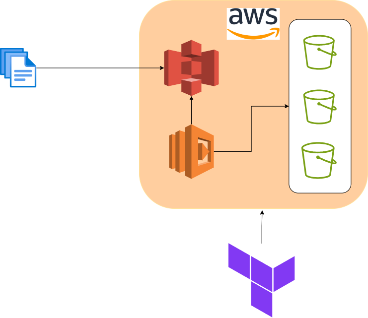

# S3_Bucket_Choose_System

## Description
This project automates the management of files in AWS using Terraform and Lambda functions. It enables the seamless movement of files between different S3 buckets based on their size, offering a scalable solution for efficient storage and data transfer within the AWS infrastructure.

## Key Features
* Automation: Fully automated process for moving files, eliminating manual intervention.
* Scalability: Scalable solution capable of handling large volumes of files with ease.
* Flexibility: Flexible configuration to adapt to specific 
project requirements.
## Prerequisites
* AWS account
* Terraform installed locally
* Basic understanding of AWS services and Terraform
## System diagram
